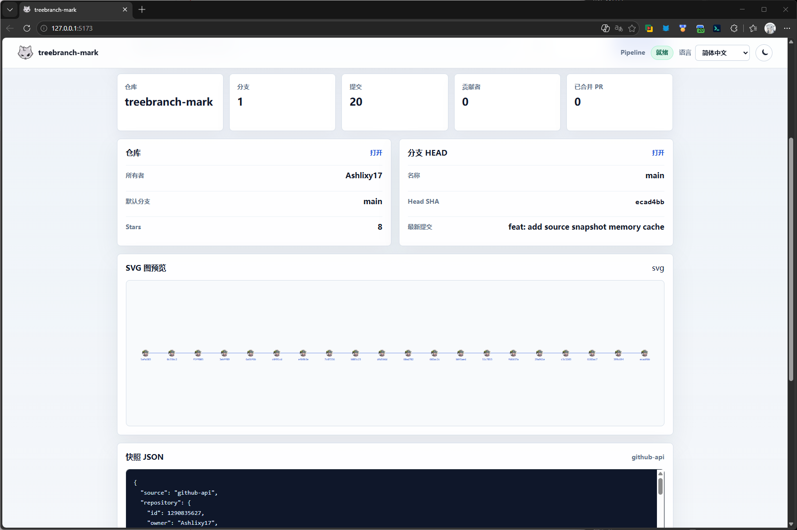

# treebranch-mark

treebranch-mark 是一个用于可视化 GitHub 项目分支演进和协作历程的 Web 工具。

项目目标是把 Git 仓库历史拆成清晰的数据流水线：从数据源读取统一快照，解析 Commit DAG，构建 Branch Graph，计算 Tree Layout，转换为 Renderer 可消费的 RenderModel，并在浏览器中输出第一版 SVG。

## 当前状态

当前项目处于 MVP 早期阶段，已完成：

- React + Vite + TypeScript 项目基础结构
- Source Layer
- GitHub API Source
- Git Source Snapshot 数据模型
- Commit Parser MVP
- Parser Review 与补充测试
- Graph Builder MVP
- Tree Layout MVP
- RenderModel MVP
- SVG Renderer MVP
- Browser Viewer Architecture Design
- Browser Viewer MVP
- RenderPipeline
- 浏览器 SVG 图预览
- Source Snapshot 调试信息
- 英语、简体中文、日语语言切换
- 浅色 / 暗夜模式切换
- 项目图标与基础品牌信息

下一阶段：

- Milestone：`v0.1.0-alpha`
- 增加可选 GitHub Token，解决匿名 API rate limit
- 完成第一张可放进 README 的 Demo 截图
- 重构 README 首页
- 准备 Release Notes 并打 `v0.1.0-alpha` tag

## 架构路线

```text
GitHub API
Local Git
GitLab
   |
   v
Source
统一 Git 数据
   |
   v
Parser
构建 Commit DAG
   |
   v
Graph Builder
构建 Branch Graph
   |
   v
Layout
Tree / Timeline
   |
   v
RenderModel
渲染数据模型
   |
   v
Renderer
SVG
```

## Source Layer

Source 层已经完成第一版，并进入冻结状态。除 Bug 修复外，后续不再扩展 Source 功能，主要精力转向 Parser 和 Graph Builder。

Source 只负责：

1. 获取数据
2. 标准化数据
3. 输出 `GitSourceSnapshot`

Source 不负责：

- Commit DAG 构建
- Branch 可达性分析
- Branch Graph 构建
- Layout 坐标计算
- Renderer 节点生成

### 核心接口

```ts
interface GitSource {
  kind: 'github-api' | 'local-git' | 'gitlab'
  loadRepository(input: GitSourceInput): Promise<GitSourceSnapshot>
}

interface GitSourceInput {
  owner: string
  repo: string
  branch?: string
  options?: GitSourceOptions
}

interface GitSourceOptions {
  maxCommitsPerBranch?: number
  includePullRequests?: boolean
  includeContributors?: boolean
  includeTags?: boolean
  cache?: 'default' | 'reload' | 'no-store'
}
```

### 数据模型原则

`GitBranch` 只表示分支引用：

```ts
interface GitBranch {
  name: string
  headSha: string
  isDefault: boolean
  url: string
}
```

`GitCommit` 只保存 Git 原始信息：

```ts
interface GitCommit {
  sha: string
  parents: string[]
  message: string
  author: GitIdentity
  committer: GitIdentity
  authoredAt: string | null
  committedAt: string | null
  url: string
}
```

Commit 不保存 `branchNames`、`reachableBranches`、`depth`、`layoutX`、`layoutY` 等派生字段。后续阶段会根据 `GitBranch.headSha` 和 `GitCommit.parents` 推导分支可达关系。

## GitHub API Source

当前第一版实现了 `GitHubApiSource`，运行在浏览器前端，直接调用公开 GitHub REST API。

目前读取的数据包括：

- repository metadata
- branches
- commits by branch
- contributors
- closed pull requests，并过滤出已合并 PR

第一版限制：

- 只支持公开仓库
- 当前稳定版本暂不处理 GitHub Token
- 不做深度分页
- 默认每个 branch 最多读取 100 个 commits
- GitHub 匿名 API 可能触发 rate limit

`v0.1.0-alpha` 将加入可选 GitHub Token 支持。Token 只属于 GitHub HTTP client 边界，不会进入 `GitSourceInput`、`GitSourceSnapshot`、`RenderPipeline.render(input)`、Parser、Graph Builder、Layout、RenderModel 或 Renderer。

## Commit Parser

Commit Parser MVP 已完成。

Parser 输入：

```ts
GitSourceSnapshot
```

Parser 输出：

```ts
interface CommitGraph {
  nodes: Map<string, CommitNode>
  roots: CommitNode[]
}

interface CommitNode {
  commit: GitCommit
  parents: CommitNode[]
  children: CommitNode[]
}

interface ParserResult {
  graph: CommitGraph
  warnings: ParserWarning[]
}
```

Parser 负责：

- 建立 `sha -> CommitNode` 索引
- 根据 `GitCommit.parents` 建立 parent 边
- 反向建立 children 边
- 找到 root commits
- 对 Missing Parent 和重复 SHA 返回 warnings

Parser 不负责：

- Branch 可达关系
- Branch Graph
- Layout
- Timeline
- SVG
- Renderer

## Graph Builder

Graph Builder MVP 已完成。

Graph Builder 输入：

```ts
CommitGraph
GitBranch[]
```

Graph Builder 输出：

```ts
interface BranchGraph {
  branches: Map<string, BranchNode>
}

interface BranchNode {
  branch: GitBranch
  head: CommitNode
  reachableCommits: Set<string>
}

interface BranchGraphBuilderResult {
  graph: BranchGraph
  warnings: BranchGraphWarning[]
}
```

Graph Builder 负责：

- 根据 `GitBranch.headSha` 解析每个分支的 head commit
- 从每个 branch head 沿 Commit DAG 向父节点遍历
- 计算每个 branch 的可达 commit 集合
- 对 missing branch head 返回 warning

Graph Builder 不负责：

- 推导分支是从哪个分支创建的
- 推导 parent branch 关系
- 计算 merge timeline
- Layout 坐标计算
- SVG 或 Renderer 输出
- 依赖 React / UI

真正的分支树关系会放到后续 Layout 或 Renderer 阶段再设计。

## Tree Layout

Tree Layout MVP 已完成。

Layout 输入：

```ts
BranchGraph
```

Layout 输出：

```ts
interface LayoutResult {
  nodes: LayoutNode[]
  edges: LayoutEdge[]
}

interface LayoutNode {
  id: string
  x: number
  y: number
}

interface LayoutEdge {
  from: string
  to: string
}
```

Tree Layout 负责：

- 从 `BranchGraph` 中读取分支和 commit 可达关系
- 默认分支优先，其余分支按名称排序
- 为每个分支分配稳定的 y lane
- 按 commit 时间为节点分配 x 坐标
- 在 `committedAt` 缺失时回退到 `authoredAt`
- 为 commit parent-child 关系生成边
- 对重复边去重
- 保持输出与 Renderer 无关

Tree Layout 不负责：

- Branch Graph 构建
- 推导 parent branch
- RenderModel
- SVG / Canvas / WebGL
- label、颜色、主题、图标、字体
- 动画和交互

当前 `LayoutResult` 是纯布局数据，不包含任何展示语义。后续会新增独立 RenderModel 层，将布局结果转换为 Renderer 可消费的数据。

## RenderModel

RenderModel MVP 已完成。

RenderModel 输入：

```ts
LayoutResult
BranchGraph
```

RenderModel 输出：

```ts
interface RenderModel {
  nodes: RenderNode[]
  edges: RenderEdge[]
}

type RenderNodeKind = 'commit'

interface RenderNode {
  id: string
  x: number
  y: number
  label: string
  kind: RenderNodeKind
  styleToken: 'commit'
}

interface RenderEdge {
  from: string
  to: string
  styleToken: 'commit-edge'
}
```

RenderModel 负责：

- 将 `LayoutNode` 映射为可渲染的 commit 节点
- 将 `LayoutEdge` 映射为可渲染的边
- 为 commit 节点生成短 SHA label
- 提供 renderer-neutral 的 `styleToken`
- 保持输出可 JSON 序列化
- 保持同样输入得到稳定输出

RenderModel 不负责：

- 布局算法
- SVG / Canvas / WebGL 渲染
- branch label / lane label
- tooltip、hover、selection
- 动画
- 主题颜色
- DOM 或 React 组件

第一版只支持 commit 图本身。后续新增 branch label、tag、merge point、HEAD、annotation、legend 时，会扩展 `RenderNodeKind`，不修改 `RenderNode` 的基础结构。

## SVG Renderer

SVG Renderer MVP 已完成。

Renderer 输入：

```ts
RenderModel
```

Renderer 输出：

```ts
string
```

SVG Renderer 负责：

- 将 `RenderEdge` 渲染为 `<line>`
- 将 `RenderNode` 渲染为 `<circle>` 和 `<text>`
- 输出完整的 standalone SVG 字符串
- 自动计算基础 `viewBox`
- 保持输出稳定、可测试
- 使用 golden snapshot 覆盖固定输入的 SVG 输出

SVG Renderer 不负责：

- Layout 坐标计算
- Graph 分析
- React 组件
- DOM / Browser API
- Canvas / WebGL
- Bezier 曲线
- hover、tooltip、selection
- theme、动画、交互

第一版只生成最小 SVG 图形。Browser Viewer 已经通过 RenderPipeline 把数据流水线串起来，让页面可以直接展示生成结果。

## Browser Viewer / RenderPipeline

Browser Viewer MVP 已完成。

Step 7 的核心不是增加新图形能力，而是把已经完成的模块串成第一条端到端可视化流水线。

新增核心层：

```text
src/pipeline/
  RenderPipeline.ts
  RenderPipeline.test.ts
  index.ts
  types.ts
```

Browser 只调用：

```ts
const result = await pipeline.render(input)
```

Pipeline 内部负责：

```text
GitHubApiSource
      |
      v
GitSourceSnapshot
      |
      v
CommitParser
      |
      v
BranchGraphBuilder
      |
      v
TreeLayout
      |
      v
RenderModelBuilder
      |
      v
SvgRenderer
      |
      v
SVG string
```

`App.tsx` 不应该直接知道 Parser、Graph Builder、Layout、RenderModel 或 Renderer 的内部串联方式。这样后续 CLI、GitHub Action、VS Code 插件都可以复用同一个 `RenderPipeline`。

Step 7 不包含：

- Timeline
- Metro
- Zoom / Pan
- Hover / Tooltip
- Theme
- Animation
- Export PNG / GIF

Step 7 已实现：

- 输入公开 GitHub 仓库
- 点击生成按钮
- 调用 `RenderPipeline`
- 从 GitHub API 读取 Source Snapshot
- 解析 Commit DAG
- 构建 Branch Graph
- 计算 Tree Layout
- 构建 RenderModel
- 生成 SVG string
- 在浏览器页面中展示 SVG 图
- 保留仓库摘要和 Snapshot JSON 调试信息

当前浏览器页面只负责 UI，不直接串联 Parser、Graph Builder、Layout、RenderModel 或 Renderer。

## v0.1.0-alpha 收尾计划

当前开发重心已从继续增加可视化模式，切换到第一个可发布版本的收尾。

`v0.1.0-alpha` 目标：

- 可选 GitHub Token 支持
- GitHub `401` 映射为 `bad-credentials`
- 三语言认证失败提示
- Token 不进入 Snapshot / JSON / Pipeline input / Pipeline result
- Token 泄露保护自动化测试
- 第一张完整 Browser Demo 截图
- README 首页重构
- Release Notes
- `v0.1.0-alpha` tag

固定产物路径：

```text
docs/
  assets/
    v0.1.0-alpha-demo.png
    v0.1.0-alpha-dark.png
    architecture.png
  releases/
    v0.1.0-alpha.md
```

README 的主 Demo 图将使用：

```md

```

`docs/releases/v0.1.0-alpha.md` 将作为 GitHub Release 正文的来源。

### Token 安全原则

所有涉及 Token、Cookie、认证信息的约束都必须有自动化测试，不能只依赖文档说明。

Token 支持的边界：

- Token 只配置在 `GitHubRestClientOptions`
- Token 不进入 `GitSourceInput`
- Token 不进入 `GitSourceSnapshot`
- Token 不进入 `RenderPipeline.render(input)`
- Token 不进入 `RenderPipelineResult`
- Token 不进入 Parser / Graph Builder / Layout / RenderModel / Renderer
- Token 不写入 `localStorage`
- Token 不写入 `sessionStorage`
- Token 不进入 URL
- Token 不进入 README 示例
- Token 不出现在 JSON 调试面板

计划中的安全测试：

```ts
const json = JSON.stringify(result.snapshot)

expect(json).not.toContain(token)
expect(json).not.toContain('ghp_')
```

## Browser Viewer 页面

当前页面是 Browser Viewer MVP，同时保留 Source Snapshot 调试信息。

已支持：

- 输入 `owner/repo`
- 输入指定 branch
- 加载公开 GitHub 仓库快照
- 通过 RenderPipeline 生成 SVG
- 展示 SVG 图预览
- 展示 repository、branches、commits、contributors、merged PRs 数量
- 展示标准化后的 JSON Snapshot
- 英语、简体中文、日语切换
- 浅色 / 暗夜模式切换

当前页面仍是 MVP 预览界面，暂不包含缩放、拖拽、hover、tooltip、导出 PNG/GIF 等能力。

## 快速开始

安装依赖：

```bash
npm install
```

启动开发服务器：

```bash
npm run dev
```

打开浏览器访问：

```text
http://127.0.0.1:5173
```

默认输入示例：

```text
vuejs/core
```

也支持 GitHub 仓库 URL：

```text
https://github.com/vuejs/core
```

## 部署状态

当前代码已经可以本地运行和生产构建。

GitHub Pages 自动部署尚未配置，所以仓库上传后不会自动生成线上网站。后续可以添加 GitHub Actions，将 `main` 分支构建产物发布到 Pages。

## 可用脚本

```bash
npm run dev
```

启动本地开发服务器。

```bash
npm run build
```

执行 TypeScript 检查并构建生产版本。

```bash
npm run lint
```

运行 Oxlint。

```bash
npm test
```

运行 Vitest 单元测试。

```bash
npm run preview
```

预览生产构建结果。

## 测试覆盖

当前测试覆盖：

- GitHub API 响应映射
- `options.maxCommitsPerBranch` 默认值和覆盖值
- branch 到 `{ name, headSha }` 的映射
- commit 按 `sha` 去重
- commit 不保存 branch 归属信息
- `404`、rate limit、网络错误映射
- `owner/repo` 和 GitHub URL 输入解析
- 线性 Commit 历史解析
- Merge Commit 多 parent 解析
- children 反向关系建立
- Missing Parent warning
- 重复 SHA warning
- Empty Repository
- Parser 不修改 Source Snapshot
- Branch head 解析
- 多分支可达 commit 集合计算
- Merge Commit 可达集合计算
- Missing Branch Head warning
- Empty Branch Graph
- Tree Layout empty graph
- 默认分支优先排序
- branch y lane 分配
- branch head lane 优先级
- commit x 坐标按时间递增
- `authoredAt` fallback
- 相同时间戳稳定排序
- parent-to-child edge 生成
- edge 去重
- Tree Layout deterministic output
- `LayoutResult` renderer-neutral 输出
- Layout 不修改 `BranchGraph` / `CommitNode`
- RenderModel empty layout
- Layout node 到 commit render node 的映射
- Layout edge 到 commit-edge render edge 的映射
- RenderModel fallback label
- RenderModel JSON 序列化
- RenderModel deterministic output
- RenderModel renderer-neutral 输出
- RenderModel 不修改 `LayoutResult` / `BranchGraph`
- SVG Renderer empty model
- SVG Renderer node circle/text 输出
- SVG Renderer edge line 输出
- SVG Renderer multiple nodes and edges
- SVG Renderer basic SVG structure
- SVG Renderer golden snapshot
- RenderPipeline 端到端 SVG 输出
- RenderPipeline missing branch head warning
- RenderPipeline source error passthrough

运行：

```bash
npm test
```

## 目录结构

```text
src/
  graph/
    BranchGraphBuilder.ts
    BranchGraphBuilder.test.ts
    index.ts
    types.ts
  layout/
    TreeLayout.ts
    TreeLayout.test.ts
    index.ts
    types.ts
  render-model/
    RenderModelBuilder.ts
    RenderModelBuilder.test.ts
    index.ts
    types.ts
  pipeline/
    RenderPipeline.ts
    RenderPipeline.test.ts
    index.ts
    types.ts
  renderer/
    index.ts
    svg/
      SvgBuilder.ts
      SvgRenderer.ts
      SvgRenderer.test.ts
      index.ts
      types.ts
  parser/
    CommitParser.ts
    CommitParser.test.ts
    index.ts
    types.ts
  source/
    types.ts
    index.ts
    types.test.ts
    github/
      GitHubApiSource.ts
      GitHubApiSource.test.ts
      githubRestClient.ts
  App.tsx
  App.css
  index.css
```

## 路线图

- [x] Source Layer
- [x] GitHub API Source
- [ ] Snapshot 序列化测试
- [x] Commit Parser MVP
- [x] Parser Review
- [x] Graph Builder Architecture Design
- [x] Graph Builder MVP
- [x] Graph Builder Review
- [x] Tree Layout Architecture Design
- [x] Tree Layout MVP
- [x] Tree Layout Review
- [x] RenderModel Architecture Design
- [x] RenderModel MVP
- [x] Renderer: SVG
- [x] Browser Viewer Architecture Design
- [x] Browser Viewer
- [x] v0.1.0-alpha Milestone Design
- [ ] v0.1.0-alpha Release Notes
- [ ] Demo Screenshot
- [ ] Theme / Animation
- [ ] GitHub Pages / GitHub Action 部署
- [ ] GitHub Token 支持
- [ ] GitHub Token 安全测试
- [ ] `bad-credentials` 错误映射
- [ ] GitLab Source
- [ ] Local Git Source
- [ ] Snapshot 缓存
- [ ] SVG/PNG 导出
- [ ] VSCode Plugin

## 开发流程

项目采用简单的 Git Flow：

- `main` 保持稳定版本
- `dev` 用于日常开发
- 每完成一个阶段后，从 `dev` 合并到 `main`

当前阶段状态：

```text
Step 1  Source Layer      done
Step 2  Commit Parser     done
Step 3  Graph Builder     done
Step 4  Tree Layout       done
Step 5  RenderModel       done
Step 6  SVG Renderer      done
Step 7  Browser Viewer    done
v0.1   Alpha Release      next
Step 8  Timeline Layout   pending
Step 9  Animation         pending
Step 10 Action / VSCode   pending
```

## 设计约束

- Source 层只输出可序列化的普通数据对象。
- Branch 是指向 Commit 的引用，不是 Commit 的属性。
- Commit 不知道自己属于哪个 Branch。
- Parser 可以构建运行时图对象，但不能修改 Source Snapshot。
- Graph、Layout、Renderer 的派生字段不进入 Source 模型。
- Layout 只输出坐标和边关系，不输出 label、颜色、SVG 或主题信息。
- RenderModel 只输出 Renderer 可消费的纯数据，不包含 SVG path、DOM、Canvas 对象或主题颜色。
- Renderer 永远不应直接依赖布局算法内部细节，通过 RenderModel 消费布局结果。
- Browser Viewer 只调用 RenderPipeline，不直接串联 Parser、Graph Builder、Layout、RenderModel 和 Renderer。
- Token、Cookie、认证信息相关约束必须有自动化测试。
- GitHub Token 只属于 GitHub HTTP client 配置，不属于 Source Snapshot 或 Pipeline input。
- 每个阶段先明确接口和职责，再进入实现。
