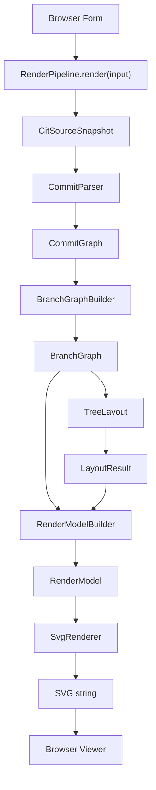

# Step 7: Browser Viewer Architecture Design

## 1. Goals

Step 7 is the first end-to-end browser-visible milestone for treebranch-mark.

The goal is to connect the existing pipeline and display the first generated SVG graph in the browser.

The MVP flow is:

```text
GitHub API
    |
    v
Source
    |
    v
Parser
    |
    v
Graph Builder
    |
    v
Tree Layout
    |
    v
RenderModel
    |
    v
SVG Renderer
    |
    v
Browser Viewer
```

Step 7 should prioritize getting a real SVG on screen over adding visual features.

## 2. Design Goals

Browser Viewer should:

- Let the user input a GitHub repository
- Run the full render pipeline
- Display the generated SVG
- Preserve useful repository summary/debug information
- Keep UI code independent from internal pipeline layers

Browser Viewer should not become the place where Parser, Graph Builder, Layout, RenderModel, and Renderer are manually wired together.

## 3. Recommended Architecture

Add a reusable pipeline layer:

```text
src/pipeline/
  RenderPipeline.ts
  types.ts
  index.ts
  RenderPipeline.test.ts
```

The browser should call:

```ts
const result = await pipeline.render(input)
```

The browser should not directly call:

- `CommitParser`
- `BranchGraphBuilder`
- `TreeLayout`
- `RenderModelBuilder`
- `SvgRenderer`

Those details belong inside `RenderPipeline`.

## 4. Responsibilities

### RenderPipeline

`RenderPipeline` is responsible for:

- Loading a repository snapshot from a `GitSource`
- Parsing the snapshot into `CommitGraph`
- Building `BranchGraph`
- Running Tree Layout
- Building RenderModel
- Rendering SVG
- Returning SVG plus useful diagnostics

`RenderPipeline` must not:

- Depend on React
- Depend on DOM APIs
- Depend on Browser APIs
- Render UI
- Manage form state
- Manage language state
- Manage theme state
- Add interactions

### Browser Viewer

Browser Viewer is responsible for:

- Reading user input
- Calling `RenderPipeline.render`
- Displaying the returned SVG string
- Displaying status, errors, and summary information

Browser Viewer must not:

- Perform graph analysis
- Perform layout
- Generate SVG itself
- Import parser, graph builder, layout, render-model, or renderer internals directly

## 5. Non-Goals

Step 7 does not include:

- Timeline Layout
- Metro Layout
- Zoom
- Pan
- Hover
- Tooltip
- Selection
- Animation
- Theme system for graph colors
- Export PNG
- Export GIF
- GitHub Action
- VS Code extension

The only visual goal is: a generated SVG appears in the browser.

## 6. Input / Output

Recommended pipeline input:

```ts
interface RenderPipelineInput {
  owner: string
  repo: string
  branch?: string
  options?: GitSourceOptions
}
```

Recommended pipeline output:

```ts
interface RenderPipelineResult {
  svg: string
  snapshot: GitSourceSnapshot
  parserWarnings: ParserWarning[]
  graphWarnings: BranchGraphWarning[]
}
```

`snapshot` remains in the result so the current browser summary can continue to show repository metadata, branch counts, commit counts, and debug JSON.

Warnings remain in the result so the browser can show diagnostics later without changing the pipeline contract.

## 7. Dependency Injection

`RenderPipeline` should accept dependencies through its constructor.

Recommended constructor shape:

```ts
interface RenderPipelineDependencies {
  source: GitSource
  parser?: CommitParser
  graphBuilder?: BranchGraphBuilder
  layout?: TreeLayout
  renderModelBuilder?: RenderModelBuilder
  renderer?: SvgRenderer
}
```

Defaults can be provided for pure local layers:

- `CommitParser`
- `BranchGraphBuilder`
- `TreeLayout`
- `RenderModelBuilder`
- `SvgRenderer`

The `source` should be explicit so tests can pass a fake source and the browser can pass `GitHubApiSource`.

This keeps the pipeline testable without network access.

## 8. Browser Integration

`App.tsx` should move from Source Snapshot Console toward Browser Viewer.

MVP behavior:

1. User enters repository and optional branch
2. User clicks Generate
3. Browser calls `pipeline.render`
4. Browser stores:
   - `svg`
   - `snapshot`
   - warnings
   - error state
5. Browser displays:
   - generated SVG
   - repository metrics
   - optional JSON/debug panel

The browser may use `dangerouslySetInnerHTML` to display the SVG string in the MVP, because the SVG is generated by the local renderer from normalized data, not from arbitrary user HTML.

The SVG viewer container should be visually distinct from the JSON debug panel.

## 9. Error Handling

`RenderPipeline` should let `GitSourceError` pass through unchanged.

The browser already knows how to translate `GitSourceErrorCode`, so preserving existing error behavior keeps Step 7 focused.

Parser and graph warnings should not throw. They should be returned in `RenderPipelineResult`.

If SVG rendering succeeds with warnings, the browser can still display the graph.

## 10. Testing Strategy

Add pipeline integration tests using a fake source.

Required coverage:

- Empty repository snapshot returns an SVG string without throwing
- Linear history snapshot produces SVG containing `<svg`, `<circle`, and `<text`
- Parent-child history produces SVG containing `<line`
- Parser warnings are returned
- Graph warnings are returned
- Pipeline does not require React, DOM, Browser APIs, or network

Browser-level tests can stay small for MVP:

- App shows the generated SVG after a successful render
- App shows the existing translated source error when the pipeline fails with `GitSourceError`

If browser tests become too expensive in Step 7, keep them minimal and rely on pipeline integration tests for core correctness.

## 11. Architecture Diagram



Future CLI, GitHub Action, and VS Code entrypoints should call the same `RenderPipeline`.

## 12. Definition of Done

Step 7 is complete when:

- `RenderPipeline` exists as a reusable core layer
- Browser calls `RenderPipeline.render`
- Browser no longer manually wires parser, graph builder, layout, render model, and renderer
- A public GitHub repository can generate an SVG in the browser
- The SVG appears on screen
- Existing repository summary remains available
- Pipeline integration tests cover fixed snapshots
- `npm test` passes
- `npm run build` passes
- `npm run lint` passes

