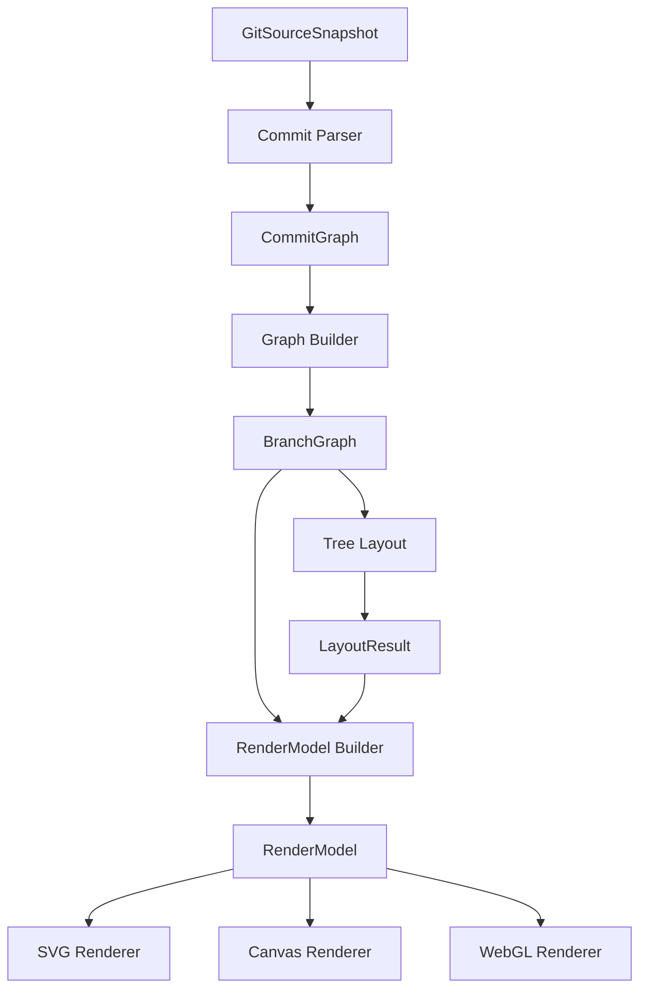

# Step 5: RenderModel Architecture Design

## 1. Goals

RenderModel is the renderer-facing data layer between `LayoutResult` and concrete renderers.

Its goal is to convert pure layout coordinates into render-ready data that can be consumed by future SVG, Canvas, WebGL, or export renderers.

RenderModel handles:

- Mapping layout nodes into render nodes
- Mapping layout edges into render edges
- Adding minimal display semantics such as labels
- Adding renderer-neutral style tokens
- Keeping renderer inputs stable across layout algorithms

RenderModel does not handle:

- Layout algorithms
- Branch reachability computation
- SVG generation
- Canvas drawing
- DOM operations
- React components
- Theme color resolution
- Interaction state
- Animation

The MVP should stay small and serve only the commit graph.

## 2. Responsibilities

RenderModel is responsible for:

- Accepting `LayoutResult` and `BranchGraph`
- Finding commit metadata for each `LayoutNode.id`
- Creating one `RenderNode` per layout node
- Creating one `RenderEdge` per layout edge
- Producing labels for commit nodes
- Assigning stable renderer-neutral style tokens
- Returning serializable plain data

RenderModel must not mutate:

- `LayoutResult`
- `BranchGraph`
- `BranchNode`
- `CommitNode`
- Source data

## 3. Non-Goals

The MVP RenderModel does not include:

- Branch labels
- Lane labels
- Tooltips
- Hover state
- Selection state
- Animation state
- Theme colors
- SVG paths
- Canvas objects
- DOM nodes
- React components
- Renderer-specific class names

These concerns belong to later renderer, theme, interaction, or animation layers.

## 4. Input / Output

Input:

```ts
LayoutResult
BranchGraph
```

Output:

```ts
RenderModel
```

The layer sits in the pipeline like this:

```text
BranchGraph
    |
    v
Tree Layout
    |
    v
LayoutResult
    |
    v
RenderModel
    |
    v
SvgRenderer
```

RenderModel needs `BranchGraph` because `LayoutResult` intentionally contains only coordinates and edge references. Labels and commit metadata must be derived from the graph layer, not from layout output.

## 5. Data Model

The MVP data model is intentionally minimal:

```ts
interface RenderModel {
  nodes: RenderNode[]
  edges: RenderEdge[]
}

type RenderNodeKind = 'commit'

interface RenderNode {
  id: string
  x: number
  y: number
  label: string
  kind: RenderNodeKind
  styleToken: 'commit'
}

interface RenderEdge {
  from: string
  to: string
  styleToken: 'commit-edge'
}
```

`RenderNode.id` should match the commit SHA in the MVP.

`RenderEdge.from` and `RenderEdge.to` should reference `RenderNode.id` values.

`RenderNode.label` should be generated from commit data. The MVP label should be deterministic and compact.

`RenderNode.kind` should use the `RenderNodeKind` union type. The MVP only allows `'commit'`, but the type is an intentional extension point for future render node kinds such as branch labels, tags, merge points, HEAD markers, annotations, and legends.

Recommended MVP label:

```text
short SHA
```

For example:

```text
4f5df0a
```

Commit messages can be added later when tooltip or richer node labels are designed.

## 6. Design Options

### Option A: Layout-Only RenderModel

Input:

```ts
LayoutResult
```

This option copies coordinates and edges into render data without reading `BranchGraph`.

Pros:

- Very simple
- Strictly separated from graph data

Cons:

- Cannot create useful labels
- Cannot access commit metadata
- Forces renderer to read graph data separately
- Reintroduces renderer coupling to graph internals

Assessment:

This is too limited for the MVP because SVG output needs labels while Layout must stay label-free.

### Option B: LayoutResult + BranchGraph RenderModel

Input:

```ts
LayoutResult
BranchGraph
```

This option uses layout output for coordinates and graph data for commit metadata.

Pros:

- Keeps Layout pure
- Keeps Renderer independent from graph internals
- Allows labels without polluting `LayoutResult`
- Works for SVG, Canvas, WebGL, and export renderers
- Keeps the MVP small and serializable

Cons:

- RenderModel Builder must resolve commit nodes by id
- Missing layout ids need a clear fallback policy

Assessment:

This is the recommended MVP design.

### Option C: Rich Semantic RenderModel

Input:

```ts
LayoutResult
BranchGraph
Theme
InteractionState
```

This option adds colors, branch labels, tooltips, hover state, selection state, and status fields now.

Pros:

- Closer to a final viewer model
- Reduces future interface churn for advanced UI

Cons:

- Pulls future concerns into the MVP too early
- Risks coupling RenderModel to theme and UI state
- Makes tests broader before SVG rendering exists
- Makes it harder to keep the first renderer simple

Assessment:

This should be deferred. The current project is not ready for theme or interaction semantics.

## 7. Recommended Design

Use Option B:

```text
Input:  LayoutResult + BranchGraph
Output: RenderModel
```

RenderModel should be built by a pure TypeScript module, for example:

```ts
interface RenderModelBuilder {
  build(layout: LayoutResult, graph: BranchGraph): RenderModel
}
```

The builder should:

1. Create an internal lookup from reachable commit SHA to `CommitNode`
2. Convert each `LayoutNode` into a `RenderNode`
3. Use the first seven characters of the commit SHA as the MVP label
4. Assign `kind: 'commit'`
5. Assign `styleToken: 'commit'`
6. Convert each `LayoutEdge` into a `RenderEdge`
7. Assign `styleToken: 'commit-edge'`

If a layout node id cannot be resolved to a commit, the MVP should still produce a render node with:

```ts
label: id.slice(0, 7)
kind: 'commit'
styleToken: 'commit'
```

This keeps the renderer resilient and avoids throwing from the display preparation layer.

## 8. Constraints

RenderModel must remain renderer-agnostic.

It must not depend on:

- React
- DOM
- SVG API
- Canvas API
- WebGL API
- CSS
- Browser globals
- Theme state
- UI components

RenderModel must be plain data and serializable with:

```ts
JSON.stringify(renderModel)
```

The MVP model should not contain `Map`, `Set`, functions, class instances, DOM references, or cyclic references.

## 9. Future Extensions

Future fields can be added after the SVG Renderer exists.

Possible future node fields:

- `title`
- `description`
- `tooltip`
- `branchNames`
- `status`
- `ariaLabel`

Possible future edge fields:

- `kind`
- `sourceKind`
- `targetKind`
- `pathToken`
- `weight`

Possible future style tokens:

- `commit-head`
- `commit-merge`
- `commit-root`
- `edge-merge`
- `edge-mainline`

These fields should still stay renderer-neutral. Concrete colors, stroke widths, fonts, and SVG path strings should remain outside the MVP RenderModel.

Possible future node kinds:

- `branch-label`
- `tag`
- `merge-point`
- `head`
- `annotation`
- `legend`

Future node kinds should be added by extending `RenderNodeKind`, not by changing the shape of `RenderNode`.

## 10. Relationship To Future Layouts

Timeline, Metro, River, Circular, and other layouts should all output `LayoutResult`.

RenderModel should not care which layout produced the coordinates.

The stable contract should remain:

```text
LayoutResult + BranchGraph
        |
        v
RenderModel
        |
        v
Renderer
```

This lets the project add new layout algorithms without rewriting SVG, Canvas, or WebGL renderers.

## 11. Architecture Diagram



## 12. Test Strategy

The implementation phase should test:

- Empty layout produces empty render model
- One layout node produces one commit render node
- Layout coordinates are copied exactly
- Commit node label uses short SHA
- Edges are copied with `commit-edge` style token
- RenderModel output is JSON serializable
- RenderModel does not mutate `LayoutResult`
- RenderModel does not mutate `BranchGraph`
- Unknown layout node ids fall back to short id labels

## 13. Definition of Done

Step 5 implementation is complete when:

- RenderModel accepts `LayoutResult + BranchGraph`
- RenderModel outputs `RenderModel`
- `RenderNode` contains `id`, `x`, `y`, `label`, `kind`, and `styleToken`
- `RenderNode.kind` uses the `RenderNodeKind` union type
- `RenderEdge` contains `from`, `to`, and `styleToken`
- The MVP only supports `kind: 'commit'`
- The MVP only supports `styleToken: 'commit'` and `styleToken: 'commit-edge'`
- RenderModel does not contain branch labels
- RenderModel does not contain tooltips
- RenderModel does not contain theme colors
- RenderModel does not contain SVG paths
- RenderModel does not contain DOM or Canvas objects
- RenderModel does not depend on React
- RenderModel output is JSON serializable
- Unit tests cover mapping, labels, edges, serialization, and immutability
