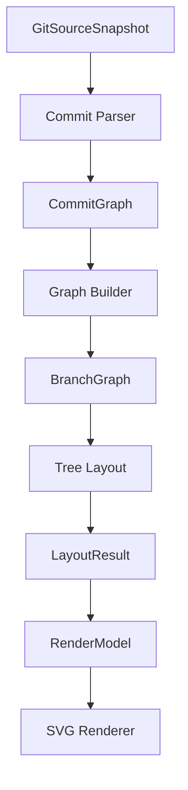
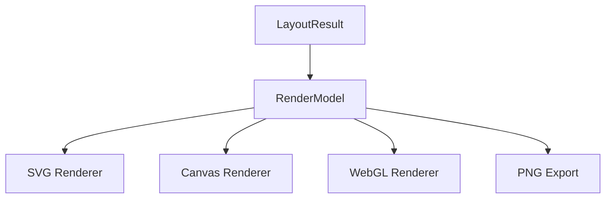

# Step 4: Tree Layout Architecture Design

## 1. Goals

Tree Layout is the first visualization-oriented algorithm layer in treebranch-mark.

Its goal is to convert a `BranchGraph` into pure layout data that later layers can render in different ways.

Layout only handles:

- Node coordinate calculation
- Edge relationship output
- Layout algorithm policy

Layout does not handle:

- SVG
- Canvas
- DOM
- Labels
- Colors
- Themes
- Icons
- Fonts
- Animation
- Interaction

The first version should prioritize correctness and stable architecture over visual beauty.

## 2. Responsibilities

Tree Layout is responsible for:

- Reading branch nodes from `BranchGraph`
- Collecting commit nodes by traversing from each `BranchNode.head`
- Sorting branches into deterministic vertical lanes
- Assigning a `y` coordinate to each branch lane
- Assigning an `x` coordinate to each reachable commit node
- Emitting layout nodes with coordinates
- Emitting layout edges between commit nodes

Tree Layout must not mutate `BranchGraph`, `BranchNode`, `CommitGraph`, `CommitNode`, or Source data.

## 3. Non-Goals

Tree Layout does not:

- Infer which branch was created from which branch
- Infer parent branch relationships
- Calculate merge timelines
- Perform crossing minimization
- Perform automatic edge avoidance
- Draw curves or Bezier paths
- Render SVG, Canvas, WebGL, or HTML
- Decide labels or display text
- Decide colors, styles, themes, or icons
- Handle user interactions
- Animate commits or branches

These concerns belong to later layers or future layout algorithms.

## 4. Input / Output

Input:

```ts
BranchGraph
```

Tree Layout should not take `CommitGraph` as a separate input.

Commit metadata and parent relationships are reachable from each `BranchNode.head`.

Output:

```ts
LayoutResult
```

The basic flow is:

```text
BranchGraph
    |
    v
Tree Layout
    |
    v
LayoutResult
```

Layout consumes the graph produced by Graph Builder and emits renderer-neutral coordinates and edges.

## 5. Data Model

The MVP layout model is intentionally small:

```ts
interface LayoutNode {
  id: string
  x: number
  y: number
}

interface LayoutEdge {
  from: string
  to: string
}

interface LayoutResult {
  nodes: LayoutNode[]
  edges: LayoutEdge[]
}
```

`LayoutNode.id` should match the commit SHA for commit nodes in the MVP.

`LayoutEdge.from` and `LayoutEdge.to` should reference `LayoutNode.id` values.

`LayoutResult` must not contain renderer-specific data such as:

- `label`
- `color`
- `stroke`
- `className`
- `svgPath`
- `icon`
- `font`
- `tooltip`

Those fields belong in RenderModel, not Layout.

## 6. Algorithm

The first Tree Layout should be simple and deterministic.

### Branch Sorting

MVP branch ordering:

1. Default branch first
2. Remaining branches sorted by name

Example:

```text
main
feature-login
feature-payment
hotfix
```

### Y Coordinate Assignment

Each branch receives a fixed vertical lane.

Recommended MVP spacing:

```ts
const branchLaneGap = 100
```

Example:

```text
main             y = 0
feature-login    y = 100
feature-payment  y = 200
hotfix           y = 300
```

### X Coordinate Assignment

Commit `x` values should be based on commit time when available.

The layout can read commit time from the `GitCommit` object inside each reachable `CommitNode`.

MVP ordering:

1. Sort commits by `committedAt`
2. Use `authoredAt` as fallback
3. Use stable traversal order as final fallback

The layout only needs to guarantee that commits in chronological order have non-decreasing `x` values.

Recommended MVP spacing:

```ts
const commitColumnGap = 120
```

### Commit Lane Assignment

For the MVP, a commit may appear in the first branch lane that reaches it.

This means shared commits do not need duplicate layout nodes per branch in Step 4.

Branch ownership is not inferred. The lane is only a visual placement strategy.

### Edge Generation

Edges are derived from commit parent relationships.

For each layout node:

- For each parent commit that also has a layout node
- Emit an edge between the parent and child

Recommended direction:

```ts
{
  from: parentSha,
  to: childSha,
}
```

Missing parents should not crash Layout. Missing-parent warnings are already handled by Parser, so Layout can simply skip edges whose endpoint is not present in `LayoutResult.nodes`.

## 7. Constraints

`LayoutResult` must stay renderer-neutral.

It must be consumable by:

- `SvgRenderer`
- `CanvasRenderer`
- `WebGLRenderer`
- PNG export pipelines
- Debug views

Layout must not depend on:

- React
- DOM
- SVG API
- Canvas API
- CSS
- Browser globals
- Theme state
- UI components

Layout should be implemented as a pure TypeScript module.

Given the same `BranchGraph` and options, it should produce deterministic output.

## 8. Future Layouts

The first layout is:

- Tree Layout

Future layouts may include:

- Timeline Layout
- Metro Layout
- River Layout
- Circular Layout
- Galaxy Layout

All future layouts should follow the same contract:

```text
Input:  BranchGraph
Output: LayoutResult
```

This allows RenderModel and Renderer layers to stay stable when new layout algorithms are added.

## 9. RenderModel

RenderModel is the renderer-facing ViewModel layer.

It sits between Layout and Renderer:

```text
LayoutResult
    |
    v
RenderModel
    |
    v
Renderer
```

RenderModel is responsible for transforming pure layout data into render-ready data.

Example:

```ts
interface RenderNode {
  id: string
  x: number
  y: number
  label: string
}

interface RenderEdge {
  from: string
  to: string
}
```

Future renderer-facing data also belongs in RenderModel:

- Colors
- Theme tokens
- Icons
- Labels
- Tooltip text
- Commit status
- Branch status
- Active state
- Merged state
- Stale state

Renderer should consume RenderModel, not `BranchGraph` or raw layout internals.

## 10. Architecture Diagram



The same RenderModel should be able to support additional renderers later:



## 11. Definition of Done

Tree Layout is complete when:

- It accepts `BranchGraph` as input
- It outputs `LayoutResult`
- It does not mutate `BranchGraph`
- It does not depend on React
- It does not depend on DOM
- It does not depend on SVG APIs
- `LayoutResult.nodes` contains only `id`, `x`, and `y`
- `LayoutResult.edges` contains only `from` and `to`
- `LayoutResult` does not contain labels
- `LayoutResult` does not contain colors
- `LayoutResult` does not contain SVG data
- `LayoutResult` can be converted directly into RenderModel
- Linear histories produce increasing `x` coordinates
- Multiple branches receive separate `y` lanes
- Missing edge endpoints are skipped without throwing
- Unit tests cover branch ordering, lane assignment, chronological x assignment, edge generation, and empty graphs
